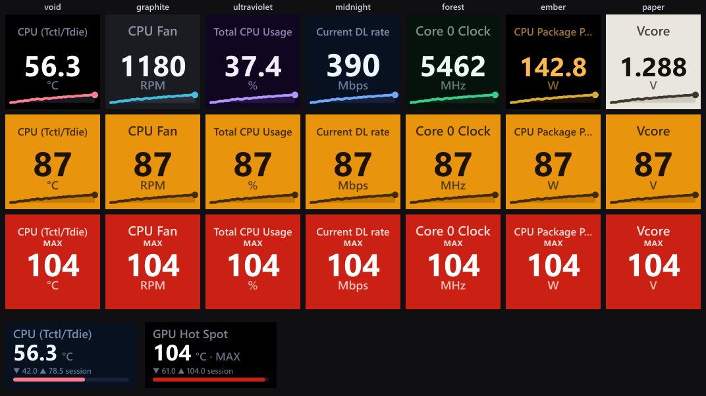
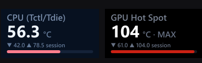
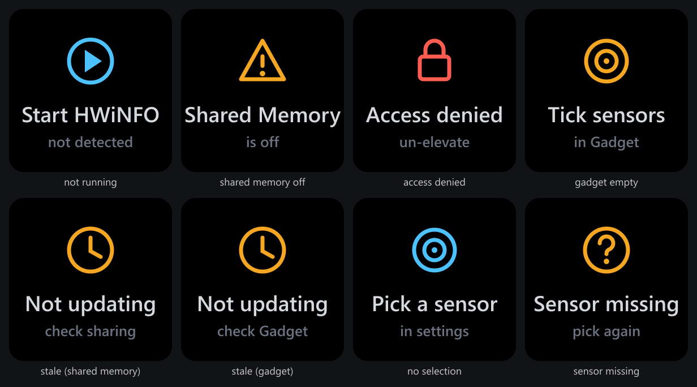

# HWiNFO Sensors for Stream Deck

<p align="center">
  
</p>

<p align="center">
  <em>Seven themes (top row) · aviation-style amber <strong>warn</strong> / red <strong>critical</strong> alerts · live sparklines · Stream&nbsp;Deck&nbsp;+ dials</em>
</p>

<p align="center">
  <a href="https://slawrensen.github.io/hwinfo-streamdeck/"></a>
  <a href="https://github.com/slawrensen/hwinfo-streamdeck/releases/latest"></a>
  
  <a href="LICENSE"></a>
  
</p>

Live [HWiNFO](https://www.hwinfo.com) sensor readings on your Elgato Stream Deck:
temperatures, clocks, fan speeds, usage, power and more. Keys show a value with
optional warn/critical coloring and a sparkline; on Stream Deck + the dials get a
touchscreen readout with rotate-to-switch and session min/max. Seven display
themes (per key or deck-wide) keep the whole wall reading as one instrument.

> **Windows only.** HWiNFO is a Windows application; this plugin reads its
> shared-memory or Gadget-registry interface locally. No ads, no telemetry,
> MIT licensed.

A ground-up TypeScript rewrite on the official Elgato SDK, inspired by the
archived [shayne/hwinfo-streamdeck](https://github.com/shayne/hwinfo-streamdeck)
(no code shared; see [NOTICE.md](NOTICE.md)).

📖 **[Full documentation & FAQ →](https://slawrensen.github.io/hwinfo-streamdeck/)**:
step-by-step setup, every key and dial setting, themes, thresholds, data sources,
status screens and troubleshooting. (The sections below are a condensed tour.)

## Requirements

- Windows 10 or later (x64), Stream Deck software **6.6+**
- [HWiNFO](https://www.hwinfo.com/download/) (installer or portable) publishing
  data on either interface: **Shared Memory Support** (preferred) or **Gadget
  reporting**. The plugin picks automatically and falls back on its own.

## Quick start

1. Install the plugin (double-click the `.streamDeckPlugin` file, or Marketplace
   once published).
2. Start HWiNFO → **Settings**:
   - ✅ **Shared Memory Support**
   - recommended: ✅ **Sensors-only**, ✅ **Auto Start**, ✅ **Minimize Sensors on Startup**
3. Drag **HWiNFO Sensors → Sensor Reading** onto a key and pick a sensor in the
   searchable list. The list groups readings by source (CPU, GPU, drives, …) and
   shows live values; type to filter.

## Data sources: Shared Memory vs. Gadget

The plugin can read HWiNFO through two interfaces and picks automatically
(*Advanced → Data source*; on dials the section is called *Dial gestures &
advanced*):

| | **Shared Memory** (preferred) | **Gadget registry** (fallback) |
| --- | --- | --- |
| Sensor coverage | everything HWiNFO measures | only sensors you tick in HWiNFO |
| Min / max / average | ✅ | current value only |
| Free version | auto-disables after **12 h** (Pro: unlimited) | ✅ no time limit |
| Enable in HWiNFO | Settings → *Shared Memory Support* | sensor context menu / Gadget page → *Report value in Gadget* |

In **Auto** mode the plugin uses Shared Memory whenever it's available and
silently falls back to the Gadget registry (e.g. after the free version's 12-hour
timer), then upgrades back when Shared Memory returns. When running on the
Gadget source, the settings panel shows a note, and min/max/avg modes display
the current value.

## Sensor Reading (keys)

| Setting | What it does |
| --- | --- |
| **Sensor** | Searchable picker over every reading HWiNFO publishes, with a live preview. |
| **Label** | Custom key label; defaults to the sensor's (renamed) label. |
| **Theme** | Preset gallery: this key only, or "Deck default" to follow the deck-wide theme. |
| **Show** | Current value, or HWiNFO's min / max / average since it started. |
| **Decimals** | Auto (magnitude-based, compacts 48 700 → `48.7k`) or fixed 0–3. |
| **Unit** | Show temperatures in °F instead of °C. |
| **Sparkline** | Draws recent history along the bottom of the key. |
| **Warn / Critical at** | Key turns amber / red at these values (in the displayed unit). |
| **Direction** | "Alert when below" flips the comparison, for fan RPM, free space, etc. |

**Pressing the key** cycles what's shown: current → MIN → MAX → AVG (badge in the
corner). The warn/critical colors always track the *live* value.

## Sensor Dial (Stream Deck +)

The touchscreen shows the label, live value, session ▼min/▲max and a range bar.

<p align="center">
  
</p>

- **Rotate**: step through the readings of the same sensor source
- **Push**: reset the session min/max/avg
- **Touch**: cycle current / session-min / session-max / session-avg
- **Long touch**: back to the current value
- **Bar range**: fixed min/max for the bar, or automatic from the session range

Dials use the same themes as keys and take the same **Warn / Critical at**
thresholds: the range bar's fill flips to the alert color while the rest of the
face stays themed (the touchscreen slot is too small for a full field flip).

## Themes

Seven presets, chosen from a live gallery in any key's or dial's settings: per
key, or once for the whole deck (*Advanced → Deck theme*). A per-key pick
always wins over the deck-wide theme. To make a key follow the deck-wide
setting, choose the gallery's dashed "Deck default" chip; the theme it
resolves to shows in the chip's tooltip and the help line under the gallery
(e.g. *currently Void*):

| Preset | Look |
| --- | --- |
| **Void** *(default)* | True black: pixels off, only the data glows. |
| **Graphite** | Near-black slate: the plugin's original look, retuned. Existing installs stay here after updating. |
| **Ultraviolet** | Deep violet cast with lavender signal. |
| **Midnight** | Blue-black with ice-blue signal. |
| **Forest** | Green-black with spring-green signal. |
| **Ember** | Amber-on-black monochrome, VFD nostalgia. |
| **Paper** | High-contrast light theme (ink on warm paper) for bright rooms and low vision. |

**Type accents** (*Advanced → Type accents*, on by default) color each key's
sparkline, badge and dial bar by sensor type: temperature rose, fan cyan, power
gold, clock green, load violet, network blue, memory magenta. Only the accent
changes; label, value and unit keep the theme's luminance rhythm. Paper ignores
type accents (accents are ink there by design).

**Alerts override everything.** At the warn threshold the whole key flips to a
bright amber field with black text; at critical, a red field with white text,
aviation-style master caution/warning (on dials, the range bar flips to the
same alert colors). The two alert palettes are global, never tinted per
theme, so warn and crit stay unmistakable on any theme and with any
color-vision deficiency.

## Key states you might see

When HWiNFO isn't publishing or a key isn't set up, it shows a clean, OLED-black
status screen that names the problem and its fix:

<p align="center">
  
</p>

| Key shows | Meaning / fix |
| --- | --- |
| **Start HWiNFO** | HWiNFO isn't publishing on either interface. Start it with Shared Memory Support (or Gadget reporting) enabled. |
| **Shared Memory off** | HWiNFO reports sharing disabled. This is also where the free version's **12-hour timer** lands: it switches sharing off (HWiNFO Pro removes the limit). Re-enable it in HWiNFO Settings, or enable Gadget reporting; Auto mode falls back to it by itself. |
| **Not updating** | Values frozen: HWiNFO's Sensors window was closed or HWiNFO stopped polling. Reopen the Sensors window; if it keeps happening, restart HWiNFO. |
| **Access denied** | HWiNFO and Stream Deck run at different privilege levels. Run both elevated or both normal. |
| **Pick a sensor** | No sensor selected yet. Open the key's settings. |
| **Sensor missing** | The saved sensor isn't in HWiNFO's current output (hardware/driver change, or a renamed sensor profile). Pick it again. |

More notes:

- **Portable build**: works identically, but only while its window is open. Add
  it to autostart yourself (no installer to do it for you), and don't run it
  from a folder that requires admin rights unless Stream Deck is elevated too.
- **Polling**: the plugin reads shared memory once per second by default
  (configurable 250 ms–5 s under *Advanced*), one reader regardless of how many
  keys are visible. HWiNFO itself updates on its own poll cycle (default 2 s).
- Sensor identity is stored as HWiNFO's stable `sensor-id : instance :
  reading-id`, so keys survive restarts and reordering, not as list positions.

## Building from source

```bash
npm ci                   # Node 20+
npm run build            # bundles to com.lawrensen.hwinfo.sdPlugin/bin/plugin.js
npm run probe            # standalone smoke test: dumps live readings (-- --gadget forces the registry backend)
npm run lint && npm run typecheck
npm test                 # unit suites: themes, key/dial renderers, shared-memory decode, status screens, series (node:test)
npm run e2e              # drives the built plugin over a mock Stream Deck WebSocket
npm run e2e:resilience   # forces the shared-memory failure states (missing, frozen, DEAD, gone) via a synthetic provider
npm run e2e:gadget       # exercises the Gadget-registry fallback via a synthetic HKCU key
npm run contact-sheet -- out   # renders all 7 themes × normal/warn/crit + dials to out/contact-sheet.png
npm run suite:full       # every suite + screenshot pipeline, fails on ANY leftover process
npm run pack             # emits release/com.lawrensen.hwinfo.streamDeckPlugin
```

Performance is tracked in [PERF.md](PERF.md); `node scripts/perf-report.mjs`
regenerates every number (sizes, live process, parse bench) in one command.

Dev loop: `streamdeck dev` once, `streamdeck link com.lawrensen.hwinfo.sdPlugin`,
then `npm run watch` (rebuilds and restarts the plugin on save).

Native access uses [koffi](https://koffi.dev) (prebuilt FFI, no node-gyp) to call
`OpenFileMappingW`/`MapViewOfFile` on `Global\HWiNFO_SENS_SM2` under HWiNFO's
consistency mutex; strides and offsets are read from the live header, never
hardcoded, so newer HWiNFO layouts (e.g. the UTF-8 label extensions) decode
correctly.

## License

[MIT](LICENSE): free software, no ads, no telemetry. Credits in
[NOTICE.md](NOTICE.md): HWiNFO (REALiX), the original plugin by
[@shayne](https://github.com/shayne/hwinfo-streamdeck), koffi, sdpi-components.

Not affiliated with, endorsed by, or sponsored by REALiX, s.r.o. or Elgato.
"HWiNFO" is a trademark of REALiX, s.r.o.; "Stream Deck" and "Elgato" are
trademarks of Corsair Memory, Inc.
